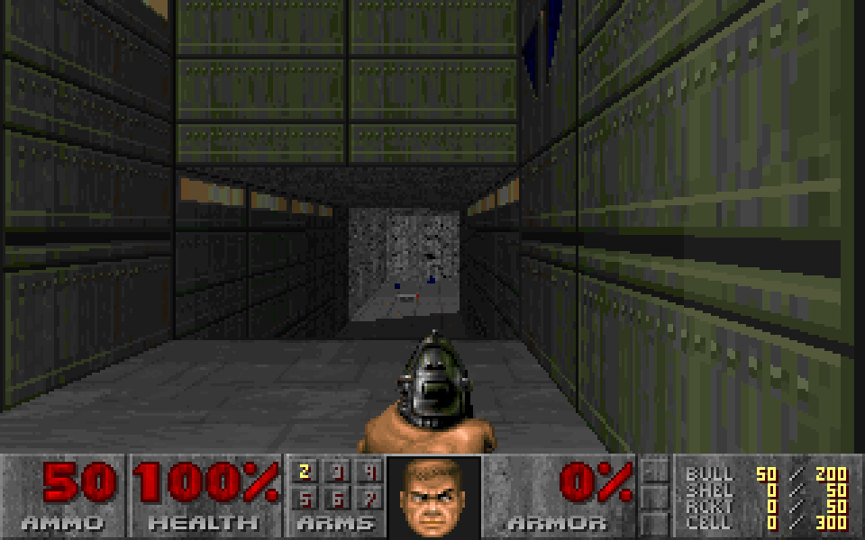

# XPaletteTonemap
Mostly accurate palette tonemapping for GZDoom.

Currently supports Doom, Heretic, Hexen, and Strife

**Screenshots:**

GZDoom with this mod:

Original Doom:

GZDoom's inbuilt tonemap:

* *GZDoom rendering at 320x200 and lighting mode "Software"*